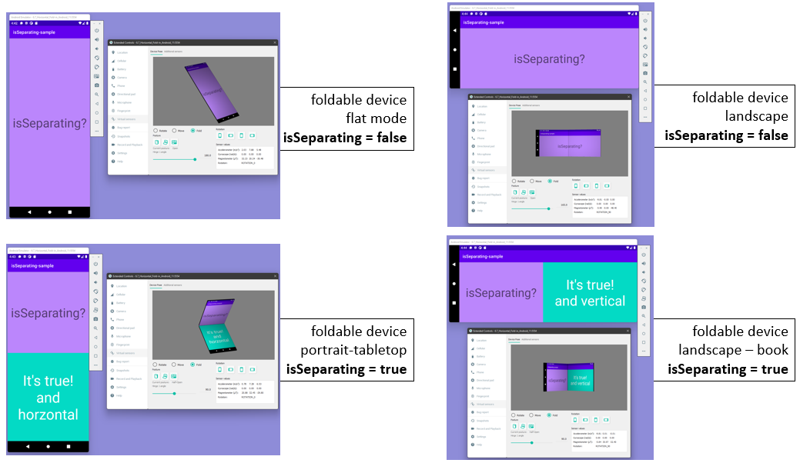
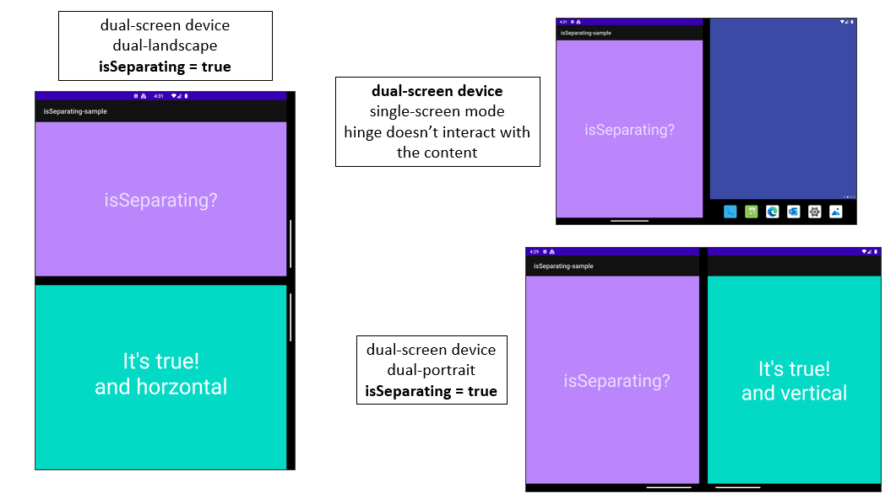

# isSeparating-sample

This is a sample app that shows the value of the Jetpack Window Manager [isSeparating](https://developer.android.com/reference/androidx/window/layout/FoldingFeature#isSeparating()) API.
This sample also utilize [MotionLayout](https://developer.android.com/reference/androidx/constraintlayout/motion/widget/MotionLayout) and [ReactiveGuide](https://developer.android.com/reference/androidx/constraintlayout/widget/ReactiveGuide). Together with [Jetpack Window Manager]((https://developer.android.com/jetpack/androidx/releases/window)) component, we also will learn how we can create dynamic UIs that adjust dynamically to the current state of the device, very useful, specifically, on foldable devices since they can take different postures and states.

## What does `isSeparating` do?

[isSeparating](https://developer.android.com/reference/androidx/window/layout/FoldingFeature#isSeparating()) is an API from the Jetpack Window Manager component that tells you whether the content is being separated by a `FoldingFeature` (e.g. the hinge in Surface Duo). isSeparating returns `true` when:
- there is `hinge` FoldingFeature; that is the indicator that there are two separated display areas.
- there is a `fold` FoldingFeature and the device is in `HALF_OPENED` posture; that is the sate that happens on foldable devices with a continuous display when they are in `laptop` or `book` mode.

Otherwise, `isSeparating` will return `false`.

If you want to have a look at the [source code of this function](https://cs.android.com/androidx/platform/frameworks/support/+/androidx-main:window/window/src/main/java/androidx/window/layout/HardwareFoldingFeature.kt), this is how it looks:
```kotlin
 override val isSeparating: Boolean
        get() = when {
            type == Type.HINGE -> true
            type == Type.FOLD && state == FoldingFeature.State.HALF_OPENED -> true
            else -> false
        }
```

Simple, but very powerful! And the best? by using this API you will be covering all foldable and dual-screen devices (such as Surface Duo).

## What does this app do?

This app shows how we can use `isSeparating` API in order to change dynamically our UI. This app uses `MotionLayout` and `ReactiveGuide` together with the `WindowLayoutInfo`, that Jetpack Window Manager provides, in order to dynamically adjust the UI whenever the content is being separated (using `isSeparating`), no matter the posture of the orientation of the device/FoldingFeature.

In foldable devices, when `isSeparating` returns `false` we will see just one `TextView`, and when `isSeparating` returns `true`, so the foldable device is in tabletop or book mode, we will see a nice animation and a new text.

The following figure can help you to understand the different postures the foldable device can take and how this affect on the result that `isSeparating` will retun.


In dual-screen devices, such as Surface Duo, when the app is in single screen mode, there is no occlusion, the hinge just separates the two physical screens but not the content, but when we `span` the app across displays, since the physical hinge separates always the content, `isSeparating` returns `true`, so the app's UI will adjust dynamically and will show an animation and an new text. If we rotate the device `isSeparating` will still return `true` since the content is being separated.

The following figure can help you to understand how `isSeparating` work on a dual-screen device where when the app is spanned, the content is always separated.



## Resources

### Learn about foldables
- [Learn about foldables](https://developer.android.com/guide/topics/large-screens/learn-about-foldables).
- [Make your app fold aware](https://developer.android.com/guide/topics/large-screens/make-apps-fold-aware).
- [Support different screen sizes](https://developer.android.com/guide/topics/large-screens/support-different-screen-sizes).

### isSeparating and Jetpack Window Manager
- [isSeparating](https://developer.android.com/reference/androidx/window/layout/FoldingFeature#isSeparating()).
- [Foldinng featurs and isSeparating guidance from Google]()
- [Jetpack Window Manager](https://developer.android.com/guide/topics/large-screens/make-apps-fold-aware)
- 

### MotionLayout and ReactiveGuide
- [Designing for foldables](https://developer.android.com/training/constraint-layout/foldables).
- [Manage motion and widget animation with MotionLayout](https://developer.android.com/training/constraint-layout/motionlayout).
- [MotionLayout examples](https://developer.android.com/training/constraint-layout/motionlayout/examples).
- [MotionLayout](https://developer.android.com/reference/androidx/constraintlayout/motion/widget/MotionLayout).
- [ReactiveGuide](https://developer.android.com/reference/androidx/constraintlayout/widget/ReactiveGuide).


## Code of Conduct

This project has adopted the [Microsoft Open Source Code of Conduct](https://opensource.microsoft.com/codeofconduct/). For more information see the [Code of Conduct FAQ](https://opensource.microsoft.com/codeofconduct/faq/) or contact [opencode@microsoft.com](mailto:opencode@microsoft.com) with any additional questions or comments.

## License

Very helpful samples has helped a lot to create this new one:
- [AndroidX ConstraintLayout experiments](https://github.com/androidx/constraintlayout/blob/main/projects/FoldableExperiments/app/src/main/java/com/example/experiments/MainActivity.kt).
- [Surface Duo Folding Video sample](https://github.com/microsoft/surface-duo-window-manager-samples/tree/main/FoldingVideo).

The above code is under [Apache License v2](https://www.apache.org/licenses/LICENSE-2.0.html) and [MIT](https://mit-license.org/) Open Source licenses.
